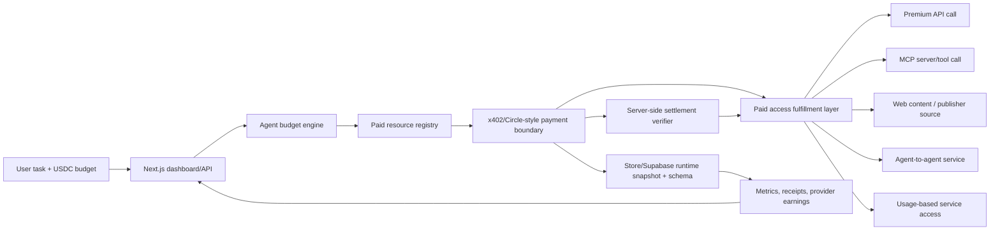

# AgentPay Gateway Architecture

## Core flow

1. The user submits a task, budget and run mode.
2. The agent scores eligible resources by expected value, freshness, confidence, cost and cache availability.
3. If a resource is worth buying, the payment boundary records the payment attempt.
4. Server-side settlement verification must confirm the x402 payment before the paid resource is fulfilled.
5. Fulfillment output is returned with citations, receipts and provider earning records.
6. The dashboard shows the event stream, spend, skipped sources, access coverage and earnings.

## Non-goals

- No mainnet execution by default.
- No upstream platform forks.
- No hidden forced payment path for presentations.
- No synthetic substitute response when a real upstream is unavailable.
- No paid access fulfillment after an unverified x402 payment.
